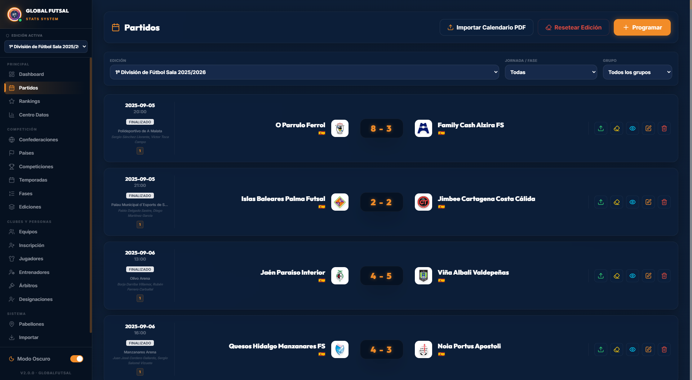
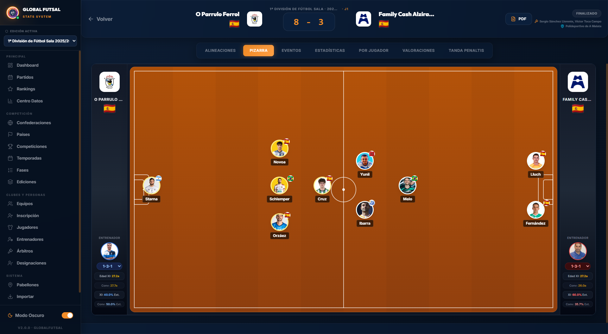

# Futsal Stats

[](https://github.com/fpons73/futsal-stats/actions/workflows/ci.yml)
[](https://www.typescriptlang.org/)
[](https://v2.tauri.app/)
[](./LICENSE)
[](https://github.com/fpons73/futsal-stats/releases/latest)

**Global Futsal Stats** — aplicación de escritorio (Windows) para gestionar y analizar
estadísticas de fútbol sala: competiciones, ediciones, equipos, jugadores, entrenadores,
árbitros, partidos con acta completa y rankings.

**[⬇️ Descargar Global Futsal Stats](https://github.com/fpons73/futsal-stats/releases/latest)** —
instalador para Windows 10/11 de 64 bits (~11 MB).

## Características

- **Gestión del dominio completo**: confederaciones, países, competiciones, temporadas,
  ediciones, fases, pabellones, equipos, plantillas, jugadores, entrenadores y árbitros.
- **Acta de partido interactiva**: alineaciones con posición inicial real (distinta de la
  natural del jugador), capitanía, eventos editables con *undo*, estadísticas por equipo
  y por jugador, tandas de penaltis y valoraciones.
- **Pizarra táctica**: alineaciones sobre el campo con posiciones reales de inicio,
  resumen de nacionalidades y edades del quinteto.
- **Acta en PDF** lista para presentación oficial: contexto (competición, temporada,
  jornada), banderas, firmas de árbitro/delegado/anotador y bloque de resumen.
- **Borrador del acta** con autoguardado, recuperación tras cierre
  accidental, aviso de cambios sin guardar y atajo `Ctrl+S`.
- **Importación masiva de CSV** (equipos, jugadores, entrenadores y competiciones) con
  idempotencia, alias de países PT→ES y manejo honesto de datos incompletos.
- **Filtros de calidad de datos**: detección y reparación manual de registros "sin
  nacionalidad" y de equipos "Desconocidos" desde las propias listas.
- **UX consistente**: tema claro/oscuro persistido, notificaciones integradas
  en la app (nada de ventanas emergentes del sistema), diálogos modales con
  foco controlado y confirmaciones temáticas.

## Instalación (usuarios)

1. Descarga el instalador `Global Futsal Stats_X.Y.Z_x64-setup.exe` (~11 MB)
   desde la página de [Releases](https://github.com/fpons73/futsal-stats/releases)
   y ejecútalo siguiendo el asistente. **Requisito**: Windows 10 u 11 de 64 bits
   (si a tu Windows le falta el componente WebView2, el instalador lo descarga
   solo).
2. **SmartScreen**: al no estar el binario firmado todavía, Windows mostrará
   «Windows protegió tu equipo» — pulsa *Más información* → *Ejecutar de todas
   formas*. Es el aviso estándar para apps sin certificado de pago; no significa
   que sea peligrosa.
3. **Tus datos se quedan en tu PC**: la app funciona sin conexión y no envía
   nada a ningún servidor; crea copias de seguridad diarias que puedes
   restaurar desde Configuración.

### Primer uso

- Al arrancar por primera vez, el **asistente de bienvenida** te ofrece elegir
   la carpeta de datos (por defecto `Documentos\Global Futsal Stats`) y detecta
   automáticamente los CSV de la enciclopedia (también en subcarpetas como
   `Futsal_Data/`) para importarlos en orden de dependencias.
- Ve a **Configuración → Herramientas de datos** para: cargar el catálogo
   mundial de países (ISO + confederación FIFA), crear una copia de seguridad
   o cambiar la carpeta de datos.
- La app crea un **backup diario automático** de la base de datos en el perfil
   de usuario y ofrece restaurarlo desde Configuración.

### Solución de problemas

- **No arranca / pantalla en blanco**: abre el panel de errores (icono de la
   barra lateral) y exporta el registro; incluye ese CSV al reportar.
- **Escudos o fotos que no se ven**: las rutas de imagen de tu BD apuntan a
   carpetas locales que no existen en tu máquina — la app muestra iniciales en
   su lugar; corrige la ruta en la ficha del equipo/jugador.
- **Importación con avisos**: el panel ámbar de la página Importar resume los
   problemas y permite exportar el informe completo en CSV/JSON.
- **Base de datos dañada**: la app la detecta al arrancar y ofrece restaurar
   la última copia verificada automáticamente.

¿Encontraste un bug? Abre un [issue](https://github.com/fpons73/futsal-stats/issues)
con los pasos para reproducirlo y, si aplica, el informe exportado.

## Capturas de pantalla

| Dashboard | Partidos | Pizarra |
|---|---|---|
|  |  |  |

## Stack

| Capa | Tecnología |
|---|---|
| Shell de escritorio | [Tauri 2](https://v2.tauri.app/) (Rust) |
| Frontend | React 19 + TypeScript 5.8 + Vite |
| Estilos | Tailwind CSS 3 |
| Base de datos | SQLite vía `tauri-plugin-sql` (sqlx) |
| PDF | jsPDF + jspdf-autotable |
| Tests | Vitest + Testing Library · tests de integración en Rust |
| CI | GitHub Actions (`tsc`, `vitest`, migraciones y tests Rust) |

## Requisitos previos (solo si compilas desde el código fuente)

> Si solo quieres **usar la aplicación**, no necesitas nada de esto: descarga
> el instalador desde [Releases](https://github.com/fpons73/futsal-stats/releases)
> y listo (ver [Instalación](#instalación-usuarios)).

- **Node.js 22+** y npm
- **Rust stable** ([rustup](https://rustup.rs/))
- **Windows**: WebView2 Runtime (incluido en Windows 10/11 modernos). Para el binario
  de pruebas con runtime mock ve `src-tauri/src/lib.rs` (notas del módulo de tests).

## Puesta en marcha

```bash
# 1. Instalar dependencias del frontend
npm install

# 2. Arrancar la app en modo desarrollo (compila el Rust y abre la ventana)
npm run tauri dev

# 3. Compilar el instalador/bundle de producción
npm run tauri build
```

El servidor de desarrollo de Vite sirve el frontend en `http://localhost:1430`
(configurado como `devUrl` de Tauri; el puerto 1420 queda libre para otras apps).

## Scripts npm

| Comando | Descripción |
|---|---|
| `npm run dev` | Solo el frontend con Vite (sin shell Tauri) |
| `npm run tauri dev` | App completa en modo desarrollo |
| `npm run build` | Comprobación de tipos (`tsc`) + build de producción del frontend |
| `npm test` | Suite de tests del frontend (Vitest, modo *run*) |
| `npm run test:watch` | Vitest en modo vigilancia |
| `npm run tauri build` | Bundle instalable de producción |

## Estructura del proyecto

```
src/
  pages/        # Una página por entidad (Dashboard, Partidos, Equipos, Jugadores…)
  components/   # Componentes compartidos (Modal, Toast, UndoToast, pizarra, PDF…)
  utils/        # Lógica: importadorMasivo.ts, csvExporters, calculadoraLiga, pdf…
  hooks/        # useFormGuard, useDialogFocus y otros hooks reutilizables
  context/      # Contextos de React (tema, modo, edición activa)
  services/     # Acceso a base de datos
src-tauri/
  src/lib.rs    # Comandos Tauri, migraciones y política de scope del fs
  migrations/   # Migraciones SQL versionadas (1-13)
  tests/        # Tests de integración de migraciones + fixtures
scripts/        # Utilidades E2E (CDP) para verificar importaciones y rendimiento
```

## Base de datos

- **Motor**: SQLite embebido vía `tauri-plugin-sql`. La BD vive en el perfil de usuario:
  `%APPDATA%\com.fpons.futsal-stats\globalfutsal.db` (WAL).
- **Esquema versionado**: las migraciones SQL están en `src-tauri/migrations/` y se
  aplican al arrancar la app (`migraciones()` en `lib.rs` es la fuente de verdad).
  La migración 13, por ejemplo, normaliza los roles legacy de `Persona`
  (`["Jugador"]`, minúsculas) al formato canónico plano `Jugador`/`Entrenador`/`Arbitro`.
- **Tests de integración**: `src-tauri/tests/migraciones.rs` aplica todas las migraciones
  a una BD virgen con el runner real de sqlx y comprueba que el esquema resultante es
  completo y utilizable — para que una migración rota reviente en CI, no en producción.

```bash
cd src-tauri
cargo test --test migraciones   # migraciones 1-13 sobre BD virgen
cargo test --lib                # tests unitarios de la lib (scope fs, validaciones)
```

## Importación de datos CSV

La página **Importar** carga ficheros CSV (separador `;`, tolera BOM) con los datos de
la enciclopedia de futsal. Cada importador es **idempotente**: reimportar el mismo
fichero no crea duplicados.

| Importador | CSV esperado (separador `;`) | Notas |
|---|---|---|
| Equipos | `nombre;nombre_completo;pais;ciudad;fundacion;titulos;…` | País resuelto contra `Pais` sin acentos |
| Jugadores | `nombre;posicion;dorsal;pais;fecha_nacimiento;equipo_actual;…` | Idempotente por nombre deportivo + fecha de nacimiento |
| Entrenadores | `nombre;pais;fecha_nacimiento;equipo_actual;titulos;…` | Enriquece la ficha con club actual y títulos (`meta`) |
| Competiciones | `nombre;pais;tipo;url;…` | Deriva tipo (Liga/Copa/Torneo) y ámbito (Clubes/Selecciones) |

Detalles importantes:

- **Países en portugués**: el matching normaliza acentos y aplica un diccionario de
  alias PT→ES (`Espanha`→España, `Itália`→Italia, `Quenia`→Kenia, `Bissau`→Guinea
  Bissau, `RD Congo`→R.D. Congo…). Los países que no casan quedan a `NULL` y se listan
  en el toast — nunca un fallback silencioso.
- **Sin nacionalidad**: los registros importados sin país quedan con nacionalidad NULL
  y son localizables desde los badges y filtros "sin nacionalidad" de las páginas
  Jugadores y Entrenadores para repararlos a mano.
- **Carpeta de datos configurable**: en **Configuración** se puede fijar la carpeta
  raíz de datos (por defecto, la del proyecto). La app amplía el *scope* de lectura del
  plugin `fs` solo hasta esa carpeta, y los importadores aceptan también una ruta
  predefinida opcional para las pruebas E2E automatizadas.

## Tests y CI

```bash
npm test                        # 340+ tests de frontend (Vitest)
cd src-tauri && cargo test      # migraciones + tests de la lib
```

GitHub Actions (`.github/workflows/ci.yml`) ejecuta en cada push a `main`:

- **Frontend**: `tsc --noEmit` + Vitest.
- **Rust**: migraciones sobre BD virgen + tests unitarios de la lib.

Adicionalmente, [`.github/workflows/release.yml`](./.github/workflows/release.yml)
compila el instalador Windows (NSIS) en cada tag `v*` y lo adjunta a un
[Release](https://github.com/fpons73/futsal-stats/releases) borrador — proceso
completo en [CONTRIBUTING.md](./CONTRIBUTING.md). El histórico de cambios por
versión está en el [CHANGELOG](./CHANGELOG.md).

## Desarrollo y verificación E2E

Para probar en la app real (diálogos nativos, puente Tauri, alcance `fs`, rendimiento
con 70k registros, capturas) hay un conjunto de scripts CDP/UIA en [`scripts/`](./scripts),
documentados en el [README de scripts](./scripts/README.md): cómo lanzar la app con el
puerto de depuración, las dos rutas de importación (diálogo nativo vs. ruta predefinida)
y las verificaciones página a página. Para validar el instalador en una VM limpia
(sin Rust/Node), sigue la [guía de prueba en máquina limpia](./docs/prueba-maquina-limpia.md).

El plan de evolución posterior a la 1.0 está recogido en el [Roadmap post-1.0](docs/roadmap.md):
firma de código, auto-actualizador y nuevas funcionalidades.

## Licencia

[MIT](./LICENSE)
