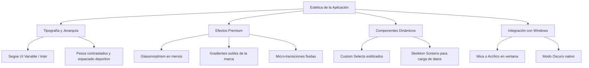

# Auditoría de Calidad y Propuesta de Mejoras - Global Futsal Stats

Este documento presenta un análisis profundo de la aplicación **Global Futsal Stats** a todos los niveles: **seguridad**, **arquitectura/configuración**, **optimización de rendimiento** y **diseño visual/UX**. El objetivo es elevar la aplicación a un nivel premium y asegurar su robustez de cara a producción.

---

## 1. Seguridad

### 🔴 Grave vulnerabilidad en el Protocolo de Activos de Tauri (Asset Protocol)
* **Situación actual (`tauri.conf.json`):**
  ```json
  "security": {
    "csp": null,
    "assetProtocol": {
      "enable": true,
      "scope": [
        "$HOME/**",
        "C:\\**"
      ]
    }
  }
  ```
* **Riesgo:** Exponer la raíz `C:\**` y `$HOME/**` permite que cualquier vulnerabilidad de inyección de código (XSS) en la interfaz frontend pueda leer o extraer **cualquier archivo** del disco duro del usuario. Desactivar CSP (`csp: null`) agrava drásticamente este problema.
* **Solución propuesta:**
  1. Definir una política de seguridad de contenido (CSP) estricta que solo permita scripts locales y de confianza.
  2. Limitar el ámbito de `assetProtocol` a una carpeta de datos específica de la aplicación (`$APPCONFIG/**` o `$APPDATA/**`) donde se almacenen las imágenes cargadas por el usuario (escudos, fotos de jugadores, banderas).

---

### ⚠️ Vulnerabilidad de Inyección SQL
* **Situación actual (Ejemplo en `Plantillas.tsx:L154` y consultas dinámicas en `CentroDatos.tsx`):**
  ```typescript
  const todos = await db.select<Persona[]>(`SELECT * FROM Persona WHERE roles LIKE '${rolBusqueda}' ORDER BY nombre_deportivo ASC`);
  ```
* **Riesgo:** Si bien `rolBusqueda` en este caso es interno, la concatenación directa de cadenas mediante interpolación (`${variable}`) en consultas SQL es propensa a fallos de seguridad y evita que el motor SQLite precompile y optimice los planes de ejecución de la consulta.
* **Solución propuesta:** Utilizar siempre consultas parametrizadas con marcadores de posición (`$1`, `$2` o `?`), los cuales ya soporta el plugin SQL de Tauri de forma nativa:
  ```typescript
  const todos = await db.select<Persona[]>(
    "SELECT * FROM Persona WHERE roles LIKE $1 ORDER BY nombre_deportivo ASC",
    [rolBusqueda]
  );
  ```

---

## 2. Configuración y Arquitectura

### 🛠️ Enlace Roto en Barra Lateral (404)
* **Situación actual:** La barra de navegación (`Sidebar.tsx`) incluye una pestaña de **Configuración** apuntando a `/configuracion`. Sin embargo, la ruta no está definida en `App.tsx` ni existe el componente `Configuracion.tsx`, lo que causa que se muestre la página de error "Página no encontrada".
* **Solución propuesta:** Crear la página de Configuración que permita al usuario personalizar la base de datos (por ejemplo, definir la ruta del archivo `.db`), alternar temas (Oscuro/Claro), exportar copias de seguridad globales, o limpiar datos en caché.

---

### 📉 Conexiones Redundantes a la Base de Datos
* **Situación actual:** En cada componente y efecto secundario (`useEffect`) de la aplicación se ejecuta de forma redundante:
  ```typescript
  const db = await Database.load("sqlite:globalfutsal.db");
  ```
* **Inconveniente:** Aunque el plugin de Tauri realiza un almacenamiento interno, inicializar la conexión en cada handler de evento y vista dificulta el mantenimiento, la depuración y no centraliza los errores de base de datos.
* **Solución propuesta:** Centralizar la base de datos creando un servicio o almacén global en Zustand (o un Provider de React) que cargue la instancia de la base de datos en el inicio de la app y la exponga de forma global:
  ```typescript
  // src/store/dbStore.ts
  import { create } from 'zustand';
  import Database from "@tauri-apps/plugin-sql";

  interface DBState {
    db: Database | null;
    initDB: () => Promise<Database>;
  }

  export const useDBStore = create<DBState>((set, get) => ({
    db: null,
    initDB: async () => {
      const existing = get().db;
      if (existing) return existing;
      const instance = await Database.load("sqlite:globalfutsal.db");
      set({ db: instance });
      return instance;
    }
  }));
  ```

---

## 3. Optimización de Rendimiento

### ⚡ Estructura y Optimización de Consultas en SQLite
1. **Consultas con `LIKE` de Texto:** El sistema filtra roles usando strings JSON o texto plano (`roles LIKE '%Jugador%'`). Esto fuerza un escaneo completo de la tabla (`Full Table Scan`) y no aprovecha los índices.
   * *Mejora:* Crear una tabla intermedia de relaciones `PersonaRol (persona_id, rol)` o usar enumerados estructurados con un índice tradicional.
2. **Índices en Claves Foráneas:** Asegurar que tablas con miles de registros (como `Alineacion`, `Evento`, `EstadisticaPartidoJugador` y `Partido`) tengan índices en sus columnas de clave foránea (`partido_id`, `persona_id`, `equipo_id`, `edicion_id`).
   * *Migración propuesta:*
     ```sql
     CREATE INDEX IF NOT EXISTS idx_alineacion_partido ON Alineacion(partido_id);
     CREATE INDEX IF NOT EXISTS idx_evento_partido ON Evento(partido_id);
     CREATE INDEX IF NOT EXISTS idx_estadistica_jugador ON EstadisticaPartidoJugador(persona_id);
     ```

---

### 📦 Carga Perezosa (Lazy Loading) de Páginas
* **Situación actual:** `App.tsx` importa de forma síncrona 18 páginas diferentes. Esto aumenta el tamaño del bundle inicial cargado en memoria al arrancar la aplicación.
* **Solución propuesta:** Implementar `React.lazy` y un componente de carga global `Suspense` para dividir el código por páginas, logrando que el inicio de la aplicación sea prácticamente instantáneo:
  ```typescript
  import { lazy, Suspense } from "react";
  const Dashboard = lazy(() => import("./pages/Dashboard"));
  // ...
  ```

---

## 4. Visualización y UX (Hacia un Diseño Premium)

Para lograr que la aplicación luzca moderna y esté a la altura de un software profesional de análisis deportivo, se proponen las siguientes mejoras estéticas basadas en tendencias actuales de diseño visual:



### ✨ 1. Glassmorphism y Gradientes
* **Fondo general:** Reemplazar el fondo plano gris `bg-gray-50` por un degradado radial muy sutil y oscuro para un modo "Dark-Mode First" o un crema/plateado sumamente elegante en modo claro (`bg-gradient-to-tr from-slate-900 via-navy to-slate-950`).
* **Tarjetas:** Emplear tarjetas con bordes semi-transparentes y un ligero desenfoque de fondo (`backdrop-blur-md bg-white/70 border border-white/20`).

### 🎨 2. Componentes Interactivos Premium
* **Custom Dropdowns:** Sustituir los `<select>` nativos del navegador por selectores interactivos estilizados usando componentes personalizados (por ejemplo, con transiciones en la apertura de listas y estados `hover` que tengan degradados).
* **Skeleton Screens:** En lugar de dejar elementos vacíos o indicadores de carga sencillos mientras se consulta la base de datos SQLite localmente, usar contenedores de carga con animación de pulso que imiten el esqueleto de la tabla o tarjeta de estadísticas.

### 🌓 3. Soporte Nativo para Modo Oscuro
* Implementar una alternancia fluida de colores (`dark:bg-navy-dark`) adaptada a la paleta de colores oficial:
  * **Navy Claro:** Para tarjetas y paneles en modo oscuro.
  * **Orange DEFAULT:** Para elementos interactivos de destaque (acentos).
  * **Silver Metálico:** Para tipografía y textos sobre fondos oscuros.

### 🖼️ 4. Efectos Visuales e Integración de Windows 11
* En Windows 11, se puede utilizar el efecto **Mica** o **Acrylic** nativo en las ventanas de Tauri mediante APIs del sistema operativo, integrando el marco de la aplicación directamente con el fondo de pantalla del usuario.
* Configurar animaciones de transición fluidas en los cambios de página de React Router usando `Framer Motion` o simples transiciones de opacidad y desplazamiento de CSS nativo.
